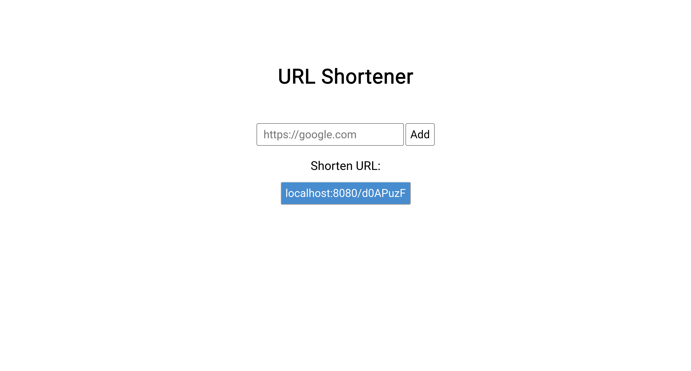

# Todo app
Written in golang using gin web framework, is considered to be one of the biggest wastes of time a human being has ever done.

## Usage
Just run the server using `go run`:

```
go run .
```

And go to localhost:8080 address in your browser.

## Screenshot:


